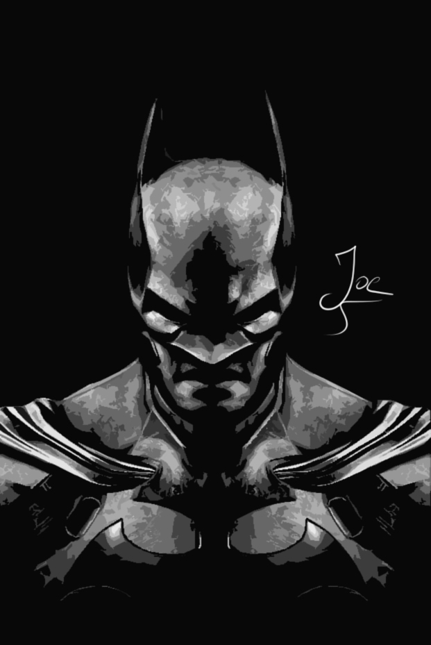
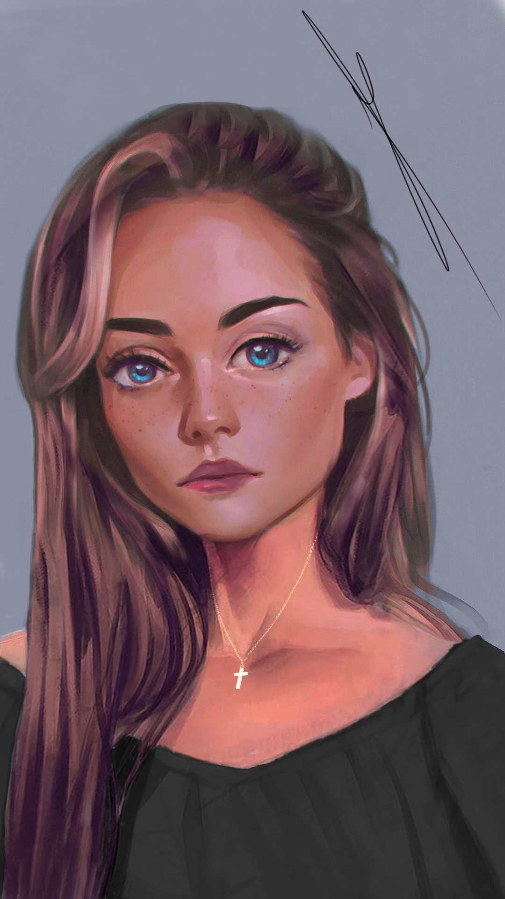
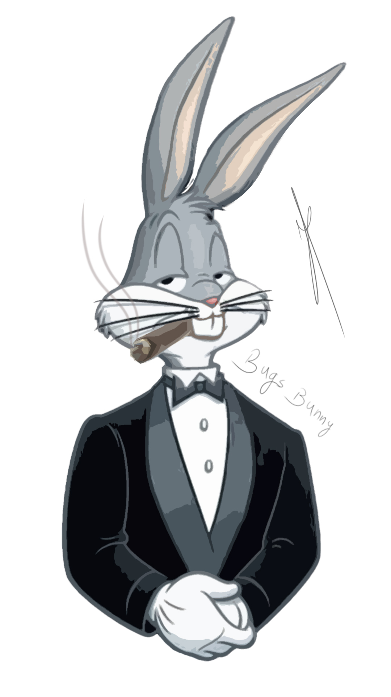

# Hello! I'm Joe👋🏻

## I'm a Developer, Physicist, and Designer!!

## 💫 About Me:
📖 I’m an open book 👨ğŸ»â€ğŸ”¬ A scientist and curious by nature 🥅 2022 Goals: Start a career in Computer Science 🦸â€â™‚ï¸ I love science fiction and technology 🨠I love to draw and make ART 🸠I am a Guitarist

## 🌐 Socials:
  

# 💻 Tech Stacks I've Worked With:
                  	

# ✏ My Art:
| Batman | Portrait | Bugs Bunny |
|----------|-----------|-----------|
||||

# 📊 GitHub Stats:
 
 

